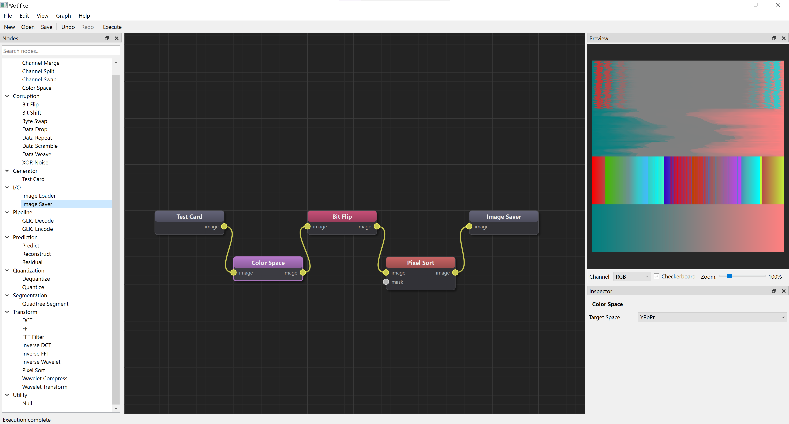

# Artifice

**Converse with Chaos, Sculpt Emergence.**

[](https://www.python.org/downloads/)
[](https://opensource.org/licenses/MIT)
[]()

A node-based glitch art application for building image processing pipelines. Chain together transforms, corruption effects, and color manipulations to create unique visual artifacts.



## What It Does

Artifice is a visual programming environment for glitch art. You build processing pipelines by connecting nodes - each node performs a specific operation like loading an image, applying a transform, corrupting data, or saving output. The node-based approach lets you:

- **Experiment freely** - Rearrange, bypass, or duplicate processing stages without rewriting code
- **See results immediately** - Real-time preview updates as you modify parameters
- **Create complex effects** - Chain operations that would be tedious to script manually
- **Save and share workflows** - Export your node graphs to recreate or share effects

### Core Capabilities

- **GLIC-style processing** - Segmentation, prediction, and quantization algorithms for structured glitch effects
- **Frequency transforms** - DCT, FFT, and wavelet decomposition for frequency-domain manipulation
- **Data corruption** - Bit flipping, byte swapping, data repetition, and structural manipulation
- **Pixel sorting** - Classic glitch aesthetic with configurable thresholds and sort criteria
- **Color space conversion** - Work in RGB, HSV, LAB, YCbCr, and other color spaces
- **Extensible** - Create custom nodes in Python

## Installation

### Prerequisites

- Python 3.10 or higher
- pip package manager

### Quick Install

```bash
# Clone the repository
git clone https://github.com/templeoflum/Artifice.git
cd Artifice

# Create a virtual environment (recommended)
python -m venv venv
source venv/bin/activate  # On Windows: venv\Scripts\activate

# Install
pip install -e .
```

## Quick Start

### Launch the Application

```bash
python -m artifice
```

### Basic Workflow

1. **Add a Test Card** - Drag "Test Card" from the Generator category (or use Image Loader for your own images)
2. **Add processing nodes** - Drag nodes from the palette onto the canvas
3. **Connect nodes** - Click an output port, then click an input port
4. **Adjust parameters** - Select a node to edit its settings in the inspector
5. **Execute** - Press Shift+E or click Execute to process the graph
6. **Save output** - Add an Image Saver node and configure the output path

### Example: Color Space Glitch

```
[Test Card] → [Color Space] → [Bit Flip] → [Pixel Sort]
```

1. Add a **Test Card** node (Generator category)
2. Add **Color Space** (Color) - leave as RGB for now
3. Add **Bit Flip** (Corruption) - set bit position to 7, probability to 1.0
4. Add **Pixel Sort** (Transform) - set mode to "brightness", lower the threshold to get visible results
5. Connect them in sequence and execute (Shift+E)
6. Now change **Color Space** to YCbCr or LAB and execute again - observe how the same corruption produces completely different effects depending on color space

## Node Categories

### I/O
- **Image Loader** - Load PNG, JPG, TIFF, WebP, BMP, GIF
- **Image Saver** - Save processed images

### Generator
- **Test Card** - Procedural calibration image with color bars, gradients, checkerboards, zone plate, and noise patterns

### Color
- **Color Space** - Convert between RGB, HSV, LAB, XYZ, YCbCr, LUV, YIQ
- **Channel Split / Merge** - Separate and recombine color channels
- **Channel Swap** - Reorder channels

### Segmentation
- **Quadtree Segment** - Adaptive segmentation by variance, edges, or gradient

### Prediction
- **Predict** - GLIC-style predictors (Horizontal, Vertical, DC, Paeth, Average, Gradient)

### Quantization
- **Quantize** - Reduce bit depth with uniform, adaptive, or per-channel modes

### Transform
- **DCT** - Discrete Cosine Transform
- **FFT** - Fast Fourier Transform
- **Wavelet** - Multi-level wavelet decomposition
- **Pixel Sort** - Sort pixels by brightness, hue, saturation, or channel value

### Corruption
- **Bit Shift / Bit Flip** - Bit-level manipulation
- **Byte Swap** - Byte-level corruption
- **XOR Noise** - XOR-based noise patterns
- **Data Repeat / Drop / Weave / Scramble** - Structural data manipulation

### Pipeline
- **GLIC Pipeline** - Combined segmentation → prediction → quantization in one node

## Programmatic Usage

```python
from artifice.core.graph import NodeGraph
from artifice.nodes.io.loader import ImageLoaderNode
from artifice.nodes.io.saver import ImageSaverNode
from artifice.nodes.transform.pixelsort import PixelSortNode

graph = NodeGraph()

loader = ImageLoaderNode()
loader.set_parameter("path", "input.png")

sort = PixelSortNode()
sort.set_parameter("sort_by", "brightness")

saver = ImageSaverNode()
saver.set_parameter("path", "output.png")

for node in [loader, sort, saver]:
    graph.add_node(node)

graph.connect(loader, "image", sort, "image")
graph.connect(sort, "image", saver, "image")
graph.execute()
```

## Project Structure

```
Artifice/
├── src/artifice/
│   ├── core/           # Node system, graph, data types
│   ├── nodes/          # Node implementations
│   │   ├── io/         # Image loading/saving
│   │   ├── generator/  # Procedural image generation
│   │   ├── color/      # Color space operations
│   │   ├── segmentation/
│   │   ├── prediction/
│   │   ├── quantization/
│   │   ├── transform/  # DCT, FFT, wavelets, pixel sort
│   │   ├── corruption/ # Bit/byte manipulation
│   │   ├── pipeline/   # Combined processing nodes
│   │   └── utility/
│   └── ui/             # Qt-based interface
├── tests/              # Test suite (277 tests)
└── docs/               # Documentation
```

## Roadmap

Current focus is on stability and usability. Planned features:

- **Analog video synthesis** - Oscillators, colorizers, keyers, and feedback systems inspired by hardware video synthesizers (LZX, Vidiot, Fairlight CVI)
- **Real-time preview** - Continuous render loop for live synthesis experimentation
- **Video processing** - Frame-by-frame processing, temporal effects, frame blending
- **Audio reactivity** - Drive parameters from audio input
- **GPU acceleration** - CUDA/OpenCL for performance-critical operations
- **AI integration** - Semantic segmentation, style transfer, learned effects

## Documentation

- [CLAUDE.md](CLAUDE.md) - Architecture, node development guide, API reference
- [docs/getting-started.md](docs/getting-started.md) - Detailed tutorial
- [docs/node-development.md](docs/node-development.md) - Creating custom nodes

## Contributing

Contributions welcome. See [CONTRIBUTING.md](CONTRIBUTING.md) for guidelines.

```bash
# Run tests
pytest

# Run with coverage
pytest --cov=artifice
```

## License

MIT License - see [LICENSE](LICENSE)

## Acknowledgments

- Inspired by [GLIC](https://github.com/snorpey/glitch-canvas) and glitch art research
- Built with [PySide6](https://www.qt.io/qt-for-python)
- Node editor concepts from Blender, Nuke, and TouchDesigner

---

*Converse with Chaos, Sculpt Emergence.*
